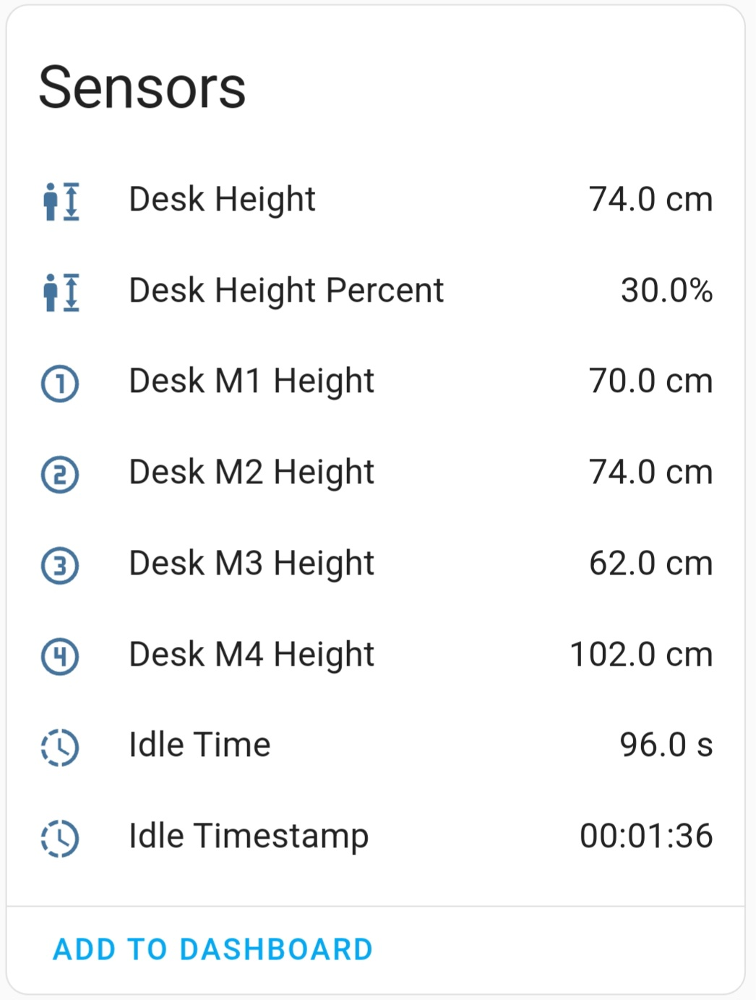
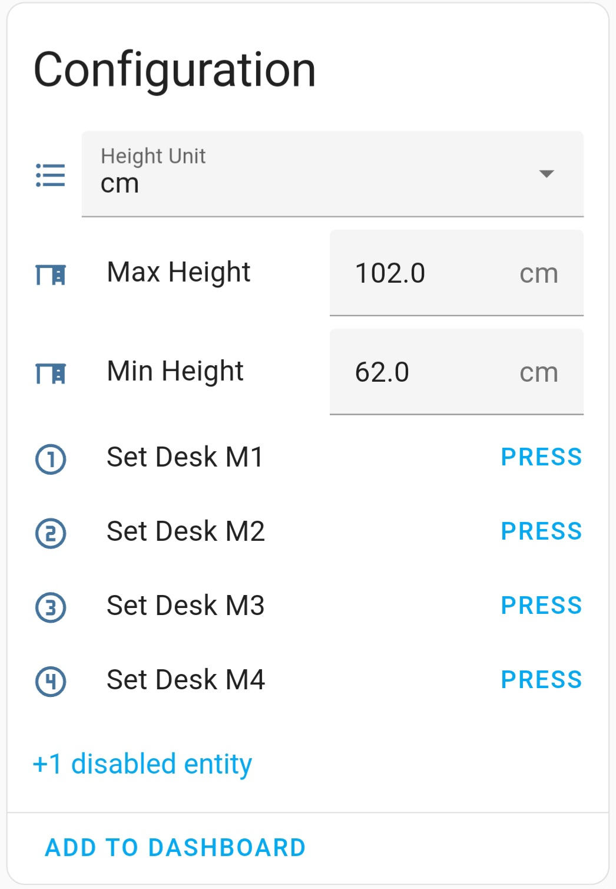

# DeskUp Pro - Making Standing Desks with RJ11 / RJ12 ports Smart

## ⚠️ Note this project is a work in-progress right now, hoping to be completed by end June 2025. 

If your desk controller has an RJ11 / RJ12 port use DeskUp Pro to integrate your desk with Home Assistant, then control your standing desk from your phone, dashboards, automations or voice.

All the existing functionality of the desks controller is retained. If you use the desk's control panel to move the desk it's height is instantly updated in Home Assistant.

### ADD PRODUCT IMAGE HERE

## What is shown in Home Assistant

  
  
  
  

### Automations you could create for your desk
- If you're sitting down for too long, then automatically raise the desk to standing height.
  - Or announce on a smart speaker that you have been sat down too long.
  - Or maybe flash a light
- If you ignore it then 5 mins later have it nag you to stand up until you do!
- Use voice e.g. Hey Google raise my desk!
- After lunchtime raise the desk so you start the afternoon standing up (maybe trigger this as you walk into the room if you have a motion sensor).
- Prefer to do meetings standing up, then if your calendar is exposed to Home Assistant you could raise the desk 1 minute before your meeting starts.
- At the end of the working day lower the desk when you turn off the office light or leave the room.
- Setup a Home Assistant dashboard so you can have an unlimited number of preset height buttons e.g. maybe each family member prefers a different sit & stand desk height.
- Want to control your desk from something else then as long as it can either integrate with Home Assistant or call a Home Assistant webhook you can.
- The DeskUp Pro device even has an RGB Led on it, and whilst the DeskUp Pro firmware doesn't currently use it we've exposed it to Home Assistant so you can use it in automations.
- etc, there are many possibilities.

### TODO ADD EBAY LINK

#### ⚠️ Check Compatibility
- You must be running Home Assistant.
- Any standing desk that has a free RJ11 / RJ12 port is likely to be compatible.
- Before you proceed check the compatibility of your [desk here](docs/compatibility.md).

You should understand the risks before purchasing, it's your responsibility to determine if its fit for your purpose. 

_This is a product of reverse engineered code where each of the desks functions was extracted by the community, not us. If you need help to determine if your desk might be compatible or find out it isnt the community sites in our need help section are a hreat place to go for advice._

### What's in the box if I bought one?
- DeskUp Pro device with attached RJ12 cable flashed with the latest firmware
- Housed in a 3D printed case
- Velcro adhesive
- Getting started guide

Plus in this repository you will find:
- Example Home Assistant dashboard cards.
- Example Home Assistant Automations.

### We test every device before we ship it
- After building a device we flash it with the latest firmware.
- We plug it into one of our desks and connect it to Home Assistant where we check the device reads the sensor values from the desk and the button controls move the desk.
- We unplug and plug back in the device multiple times to check the cable and components are connected securely.
- Finally we reflash the firmware and package it up in bubble wrap for shipping.

### Specs
- The firmware of the DeskUp Pro is based on ESPHome
- The device itself uses an ESP32 chip that is powered by the desk's controller over the RJ11 / RJ12 Cable, so no USB cable is needed to power it.
- Protocol used is 2.4ghz Wi-Fi 
- Initial setup of the device to connect it to Home Assistant can be done using a USB C cable (not supplied), Bluetooth or a Captive Portal (Wi-Fi hotspot).

## Prefer to build one yourself 
In this Github repository you can find everything to do just that:
- Instructions on how to build/wire up the ESP32.
- The full source code to control the desk.

However if you would prefer to avoid:
- Buying the parts
- Soldering it all together
- 3d printing a case
- Downloading & flashing the firmware

And would simply like to get a device pre-built, in a box that you can plug in to your desk and be automating it in 10 minutes then you can purchase one from our eBay shop.

### Documentation
[Setup a purchased device](docs/setup/README.md)

Build one yourself TODO

[Configure the device in Home Assistant](docs/configuration/README.md)

### Need Help
The community sites are a great place to ask for advice:

https://community.home-assistant.io/t/maidesite-standing-desk-with-esphome/602293

https://community.home-assistant.io/t/desky-standing-desk-esphome-works-with-desky-uplift-jiecang-assmann-others/383790?u=mahko_mahko

### License

