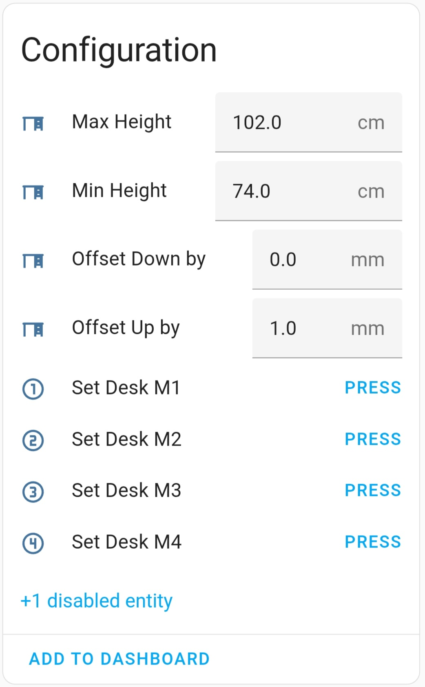

# DeskUp Pro - Making Standing Desks with an RJ11 / RJ12 port Smart

## ⚠️ Note this project is a work in-progress right now, expect to be completed by end June 2025. 

If your standing desk controller has an RJ11 / RJ12 port use DeskUp Pro to integrate your desk with your smart home automation system to control your standing desk from your phone, dashboards, automations or voice.

DeskUp Pro has full integration with Home Assistant but any smart home hub that can send a Rest Api request is also supported using its [Api](docs/configuration/rest-api.md).

All the existing functionality of the desk's controller is retained, the DeskUp Pro just lets you control it from your smart home system.

### ADD PRODUCT IMAGE HERE

## Why did we start this project?
To integrate the desk into my Smart Home System so Alexa can tell me to stand up more!

I ended up combining code from a few different sources written by the community and then kept adding more features. I then realised that RJ12 devices were only available to people who could build their own device and had Home Assistant. 

That's when I decided to:
- Fully document everything we had done into this Git repository
- Make the device accessible to other Smart Home systems using the ESPHome Api
- Start selling DeskUp Pro devices to anyone that wants one but in the spirit of open source if you want to make your own all the details to do that are in here too.

### TODO ADD EBAY LINK

## What is shown in Home Assistant

  
  
  
  

31 entities are exposed in Home Assistant that let you control every function of the DeskUp pro.

## Or other smart home systems can use the built in Web Interface and its Rest API

  
  

Every function of the DeskUp pro can be controlled using its [Api](docs/configuration/rest-api.md).

### Automations you could create for your desk
- If you're sitting down for too long, then automatically raise the desk to standing height.
  - Or announce on a smart speaker that you have been sat down too long.
  - Or maybe flash a light
- If you ignore it then 5 mins later have it nag you to stand up until you do!
- Use voice e.g. Hey Google raise my desk!
- After lunchtime raise the desk so you start the afternoon standing up (maybe trigger this as you walk into the room if you have a motion sensor).
- Prefer to do meetings standing up, then if your calendar is exposed to Home Assistant you could raise the desk 1 minute before your meeting starts.
- At the end of the working day lower the desk when you turn off the office light or leave the room.
- Setup a dashboard on your smart home hub so you can have an unlimited number of preset height buttons e.g. maybe each family member prefers a different sit & stand desk height.
- Want to control your desk from something else then as long as it can either integrate with Home Assistant or call a Rest Api you can.
- The DeskUp Pro device even has an RGB Led on it, and whilst the DeskUp Pro firmware doesn't currently use it we've exposed it so you can use it in automations.
- etc, there are many possibilities.

#### ⚠️ Check Compatibility
- Any standing desk that has a free RJ11 / RJ12 port could be compatible.
- Before you proceed check the compatibility of your [desk here](docs/compatibility.md).

You should understand the risks before purchasing, it's your responsibility to determine if its fit for your purpose. 

_This is a product of reverse engineered code where each of the desks functions were extracted by the community, not us [and can be found here](/docs/diy/desk-hex-codes.md). 
If you need help to determine if your desk might be compatible or find out it isnt the community sites in the [need help section](#need-help) are a great place to go for advice._

### What's in the box if I bought one?
- DeskUp Pro device with attached RJ12 cable flashed with the latest firmware
- Housed in a 3D printed case
- Velcro adhesive
- Getting started guide

Plus in this repository you will find:
- Example Home Assistant [dashboard cards](docs/configuration/home-assistant-dashboard.md).
- Example Home Assistant [automations](docs/configuration/home-assistant-automations.md).
- For other smart home systems use our [api documentation](docs/configuration/rest-api.md).

### We test every device before we ship it
- After building a device we flash it with the latest firmware.
- We plug it into one of our desks and connect it to Home Assistant where we check the device reads the sensor values from the desk and the button controls move the desk.
- We unplug and plug the device back in multiple times to check the cable and components are connected securely.
- Finally we reflash the firmware and package it up in bubble wrap for shipping.

### Specs
- The firmware of the DeskUp Pro is based on ESPHome
- The device itself uses an ESP32 chip that is powered by the desk's controller over the RJ12 Cable, so no USB cable is needed to power it.
- Protocol used is 2.4ghz Wi-Fi 
- Initial setup of the device to connect it to Wi-Fi can be done using a USB C cable (not supplied), Bluetooth (if you use Home Assistant and have a Bluetooth proxy) or a Captive Portal (Wi-Fi hotspot).

## Prefer to build one yourself 
In this Github repository you can find everything to do just that:
- Instructions on how to build/wire up the ESP32.
- The full source code to control the desk wriiten using community reverse engineered desk logic (from multiple git repos) we pulled together what we thought were the best bits into this project.
- We decided to make this a yaml only version of the code to make it easier for non c++ programmers to understand and change.
- Then added a number of our own features to it.
- You will need to use ESPHome Builder in Home Assistant to follow our guide.

However if you would prefer to avoid:
- Buying the parts
- Soldering it all together
- 3d printing a case
- Downloading & flashing the firmware

And would simply like to get a device pre-built, in a box that you can plug in to your desk and be automating it in 10 minutes then you can purchase one from our eBay shop.

### TODO ADD EBAY LINK

### Documentation
[Setup a purchased device](docs/setup/README.md)

[Build one yourself](docs/diy/README.md)

[Configure the device for your smart home hub](docs/configuration/README.md)

### Need Help
The community sites are a great place to ask for advice, especially if it's to do with desk compatibility:

https://community.home-assistant.io/t/maidesite-standing-desk-with-esphome/602293

https://community.home-assistant.io/t/desky-standing-desk-esphome-works-with-desky-uplift-jiecang-assmann-others/383790?u=mahko_mahko

If it's not a compatibility question, and prehaps you have an idea for a new feature to add, or find out there are other desk hex codes and know what they are and do, then log an issue to this Git Repo and we will try to help, or even better submit a pull request with the change.

### License

