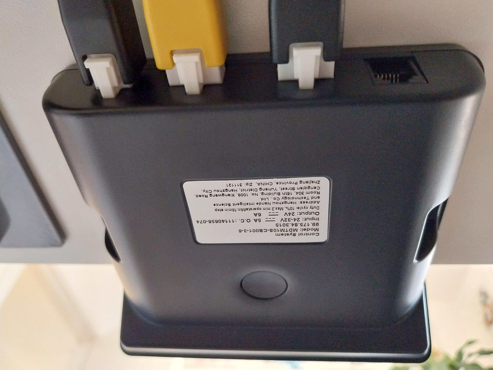
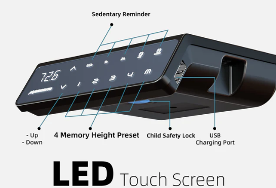
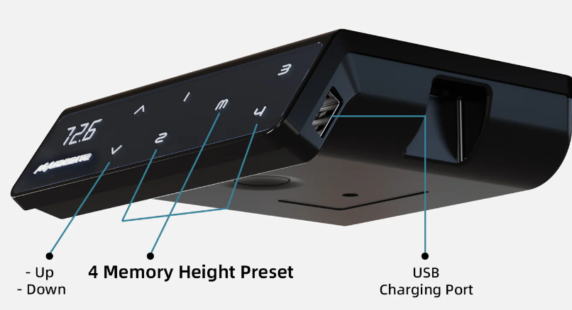

# ⚠️ Check if your desk is compatible
You should understand the risks before purchasing any components to build this yourself or if you purchase a prebuilt one from the shop. It's your responsibility to determine if its fit for your purpose. 

- Your desk must have a free RJ12 port on the controller (6 pins)
- Or sometimes it's an RJ11 port which is the same size it just has 4 pins. Which is fine because even with the 6 pin RJ12 we only use 4 wires anyway. The 1st and last wires are not used.
- Sometimes the controller will indicate an RJ11/12 with an 'F' next to it.

- There is no guarantee that this device will work with your desk due to the different models out there. and the desk manufacturer can change their specifications at anytime even on the same model number.

- As this is a product of reverse engineering (by the community), until you try it on your desk there is no way to be 100% certain that it will or won't work.

## Maidesite desks using the Premium controller 
These desks should be compatible as members of the community have used this controller on some of these.

- TH2 Plus Art
- T2 Pro
- T2 Pro Plus
- SC2 Pro
- EL2 Pro Art
- EL2 Plus Art
- S2B Pro

## Maidesite desks using the Standard controller
This has a very similar design to the Premium one above but as of now no one in the community has tested it. 

It has the same 4 presets and nudge up/down as the Premium controller above does, it just has a slightly different screen layout. It does have an RJ12 port. There is a good chance these might be compatible.

- T1 Pro
- SN1

# Other manufacturer desks or controllers that should be compatible
Members of the community have tested these desks or controllers on other similar projects to this one, which appear to send the same commands so there is a good chance these are compatible.

## IKEA MITTZON

Confirmed working in post 3: 

https://github.com/phord/Jarvis/issues/33

## Ikea Uppspel
Confirmed working using RJ11 cable (4 pins which is fine as RJ12 has 6 but only uses 4)

https://community.home-assistant.io/t/desky-standing-desk-esphome-works-with-desky-uplift-jiecang-assmann-others/383790/443

## Desktopia Pro X
Confirmed working once the correct pins were specified in config (mentioned here if you read the entire chain)

https://community.home-assistant.io/t/desky-standing-desk-esphome-works-with-desky-uplift-jiecang-assmann-others/383790/420

## Jiecang JCB35M11C
  
Confirmed as device used at top of this post
https://github.com/Rocka84/esphome_components/blob/a083c17882361c58071b85d45587c410582cda75/components/jiecang_desk_controller/

https://www.jiecang.com/product/jcb35m11c.html

 

**It's very likely that other Jiecang controllers are supported too which are used on Fully Jarvis and Desky desks.**

 

## Links to other community info used when compiling this list
https://www.maidesite.co.uk/pages/buyer-guide

https://github.com/phord/Jarvis#physical-interface-rj-12

https://community.home-assistant.io/t/desky-standing-desk-esphome-works-with-desky-uplift-jiecang-assmann-others/383790?u=mahko_mahko

