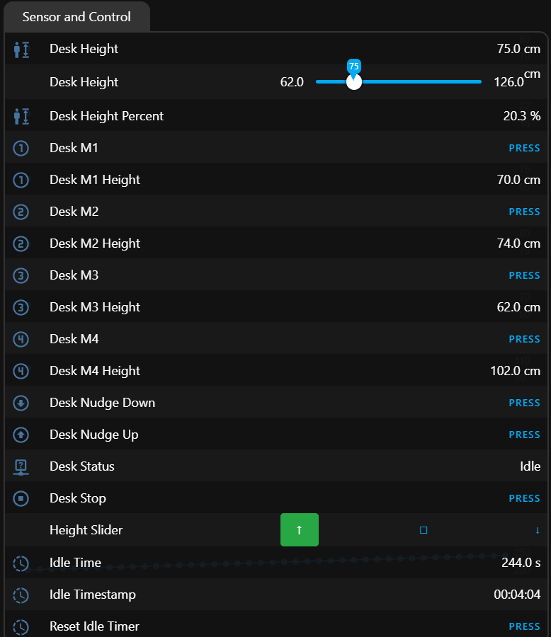
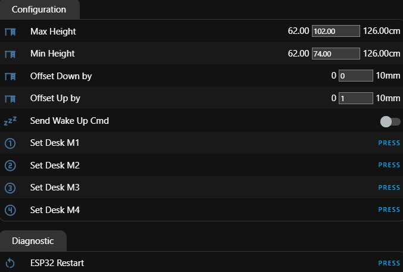

# Configure the DeskUp Pro in Home Assistant & Homey Pro

Before you use the DeskUp Pro make sure to specify your desks min / max physical limits and familiarise yourself with the screen layout here:

[Screen Layout and what it all does](screen-layout/README.md)

[Firmware Updates](firmware-updates.md)

# Home Assistant Examples

[Example Dashboard](home-assistant-dashboard.md)

[Example Automations](home-assistant-automations.md)


# Configure and use the DeskUp Pro with another Smart Home Hub
**Unfortunately we had to remove the ESPHome Web server as it does not comply with EN 18031-1 cyber security standards which means the Web UI and API are not available.  This affects devices shipped from 1st October 2026.**

**You can adopt the device in ESPHome yourself and add the web server back in, we just cannot ship devices with it. Instead we will be looking to build native integrations for smart home platforms**

Before you use the DeskUp Pro make sure to specify your desks min / max physical limits using the built in Web server.  
[Read this page on why this is important](screen-layout/screen-layout-configuration.md#max-height-defaults-to-cm).
You can also control every aspect of the DeskUp Pro with this interface.

To open the DeskUp Pro web interface enter this in a web browser: 
```
http://device-ip-number
```

<p align="center">
  
  
</p>

Once the device is configured with Min Height and Max Height values that match your needs use the rest api from your smart home hub to control your desk.

[Rest API](rest-api.md)

