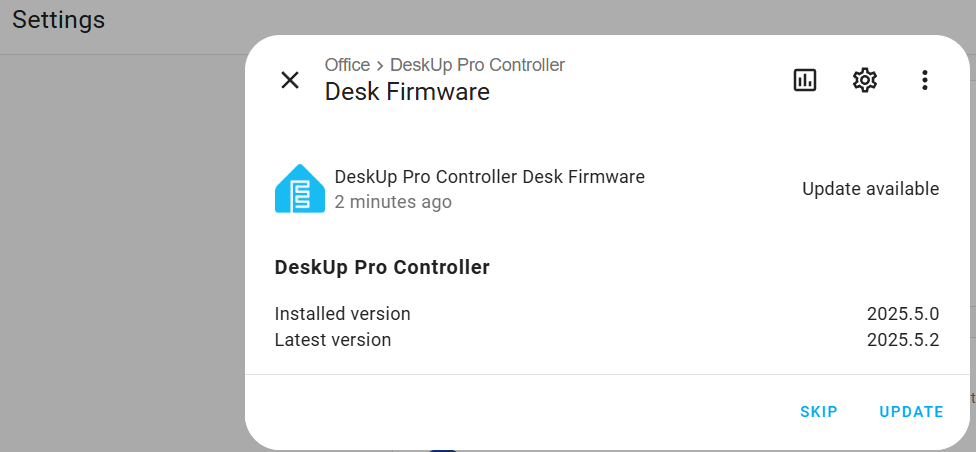

# Firmware Updates
Occasionally we might update the code for the DeskUp Pro, when we do you will receive an update notification in Home Assistant.



Install this as you Normally would.

Note: Users who upgrade this way who have adopted the device in ESPHome Builder may see this error.  


The device in Home Assistant will also appear as unavailabe until you accept the repair notification.  
However whilst that brings the device online in ESPHome Builder the logs will show this message.

```WARNING deskup-pro-controller @ 192.168.xx.xx: Connection error occurred: deskup-pro-controller @ 192.168.xx.xx: The device is using plaintext protocol; Try enabling encryption on the device or turning off encryption on the client (ESPHome Logs 2025.4.0) ```

To fix this, just install the firmware manually in ESPHome Builder. 
