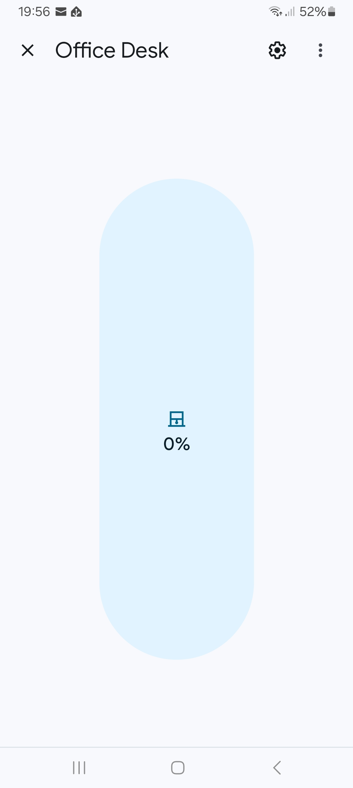
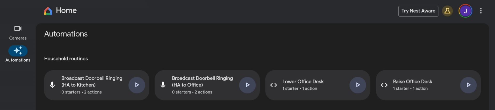

# Example Home Assistant Automations

## Contents
[Hey Google Raise the Desk](#Hey Google Raise the Desk)

## Hey Google Raise the Desk
The DeskUp Pro has a Cover entity. Exposing this entity to Google Home allows it to be controllable as a device in Google Home.

One option is to use the Home Assistant Matter Hub addon to expose the device to Google Home.



Unfortunately the Google Home App does not allow you to choose the cover as a device to control in automations, but the preview web editor does.
http://home.google.com



```
metadata:
  name: Raise Office Desk
  description: Scripted automation

automations:
  starters:
    - type: assistant.event.OkGoogle
      eventData: query
      is: raise the desk

  actions:
    - type: device.command.OpenClose # Set the open-close state of the device
      # Indicates the percentage that a device is opened, where 0 is closed and 100 is fully open. [Available parameter options: openPercent, openDirection]
      openPercent: 100
```
