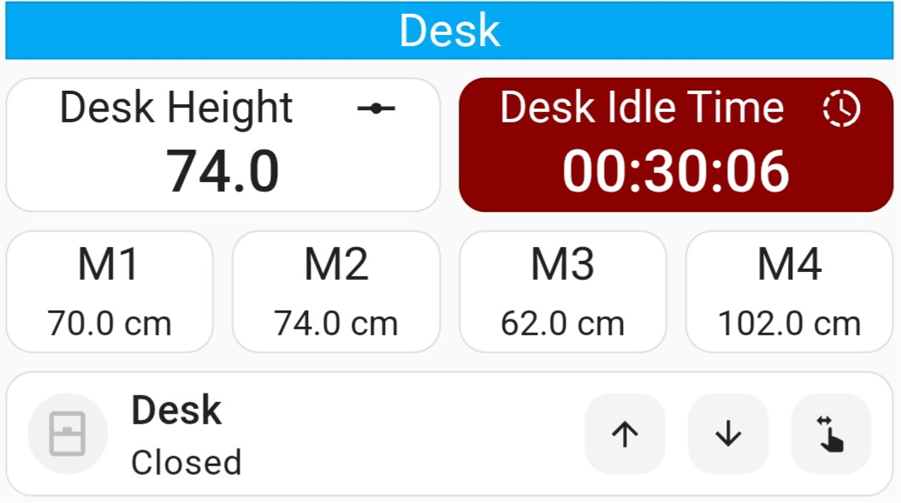

# Example Home Assistant Dashboard

On here we are using the custom button-card to show:
- The current height of the desk.
- How long the desk has been idle for.
- The 4 desk memory preset buttons with the height of each pulled in from the desk via the sensors.

And using the 'Mushroom Cover Card' to render the height cover.


After 30 minutes with the desk at sitting height the background changes colour on the 'Desk Idle Time' card to indicate its time to standup.



Yaml for this:
```
views:
  - title: Home
    type: sections
    max_columns: 1
    dense_section_placement: true
    sections:
      - type: grid
        cards:
          - type: custom:button-card
            entity: sensor.deskup_pro_controller_desk_height
            show_state: false
            show_label: true
            show_icon: true
            name: Desk Height
            icon: mdi:ray-vertex
            size: 25px
            numeric_precision: 1
            label: |
              [[[
                var value = states["sensor.deskup_pro_controller_desk_height"].state;
                return value;
              ]]]
            grid_options:
              columns: 6
            styles:
              grid:
                - grid-template-columns: auto
                - grid-template-rows: 1fr
                - grid-template-areas: |
                    "n i"
                    "l l"
              card:
                - height: 60px
                - font-size: 15px
                - padding: 2px
              icon:
                - height: 20px
                - width: 20px
                - margin-right: 10px
                - margin-top: 0px
              name:
                - margin-left: 0px
                - margin-top: 0px
              label:
                - font-size: 20px
                - font-weight: 500
                - margin-top: 0px
                - margin-bottom: 0px
                - padding-top: 2px
          - type: custom:button-card
            entity: deskup_pro_controller_height_slider
            show_state: false
            show_label: true
            show_icon: true
            name: Desk Idle Time
            icon: mdi:progress-clock
            size: 25px
            numeric_precision: 1
            label: |
              [[[
                var value = states["sensor.deskup_pro_controller_idle_timestamp"].state;
                return value;
              ]]]
            grid_options:
              columns: 6
              rows: 1
            styles:
              grid:
                - grid-template-columns: auto
                - grid-template-rows: 1fr
                - grid-template-areas: |
                    "n i"
                    "l l"
              card:
                - height: 60px
                - font-size: 15px
                - padding: 2px
                - background: |
                    [[[ 
                      var idletime = states["sensor.deskup_pro_controller_idle_time"].state;
                      var height = states["sensor.deskup_pro_controller_desk_height"].state;
                      if( height < 80 && idletime >= 1800 ) {
                        return "darkred";
                      }
                    ]]]
                - color: |
                    [[[ 
                      var idletime = states["sensor.deskup_pro_controller_idle_time"].state;
                      var height = states["sensor.deskup_pro_controller_desk_height"].state;
                      if( height < 80 && idletime >= 1800 ) {
                        return "white";
                      }
                    ]]]
              icon:
                - height: 20px
                - width: 20px
                - margin-right: 10px
                - margin-top: 0px
                - color: |
                    [[[ 
                      var idletime = states["sensor.deskup_pro_controller_idle_time"].state;
                      var height = states["sensor.deskup_pro_controller_desk_height"].state;
                      if( height < 80 && idletime >= 1800 ) {
                        return "white";
                      }
                    ]]]
              name:
                - margin-left: 0px
                - margin-top: 0px
              label:
                - font-size: 20px
                - font-weight: 500
                - margin-top: 0px
                - margin-bottom: 0px
                - padding-top: 2px
          - type: custom:button-card
            entity: sensor.deskup_pro_controller_desk_m1_height
            name: M1
            show_icon: false
            show_name: true
            show_state: true
            tap_action:
              action: call-service
              service: button.press
              target:
                entity_id: button.deskup_pro_controller_desk_m1
            grid_options:
              columns: 3
            styles:
              card:
                - padding: 10px
                - border-radius: 12px
                - font-size: 16px
                - height: 55px
              state:
                - font-size: 12px
                - padding-top: 5px
          - type: custom:button-card
            entity: sensor.deskup_pro_controller_desk_m2_height
            name: M2
            show_icon: false
            show_name: true
            show_state: true
            tap_action:
              action: call-service
              service: button.press
              target:
                entity_id: button.deskup_pro_controller_desk_m2
            grid_options:
              columns: 3
            styles:
              card:
                - padding: 10px
                - border-radius: 12px
                - font-size: 16px
                - height: 55px
              state:
                - font-size: 12px
                - padding-top: 5px
          - type: custom:button-card
            entity: sensor.deskup_pro_controller_desk_m3_height
            name: M3
            show_icon: false
            show_name: true
            show_state: true
            tap_action:
              action: call-service
              service: button.press
              target:
                entity_id: button.deskup_pro_controller_desk_m3
            grid_options:
              columns: 3
            styles:
              card:
                - padding: 10px
                - border-radius: 12px
                - font-size: 16px
                - height: 55px
              state:
                - font-size: 12px
                - padding-top: 5px
          - type: custom:button-card
            entity: sensor.deskup_pro_controller_desk_m4_height
            name: M4
            show_icon: false
            show_name: true
            show_state: true
            tap_action:
              action: call-service
              service: button.press
              target:
                entity_id: button.deskup_pro_controller_desk_m4
            grid_options:
              columns: 3
            styles:
              card:
                - padding: 10px
                - border-radius: 12px
                - font-size: 16px
                - height: 55px
              state:
                - font-size: 12px
                - padding-top: 5px
          - type: custom:mushroom-cover-card
            entity: cover.deskup_pro_controller_height_slider
            fill_container: true
            show_position_control: true
            show_tilt_position_control: false
            show_buttons_control: true
            grid_options:
              columns: full
            name: Desk
            layout: horizontal
            hold_action:
              action: none
            double_tap_action:
              action: none
            tap_action:
              action: more-info
```
