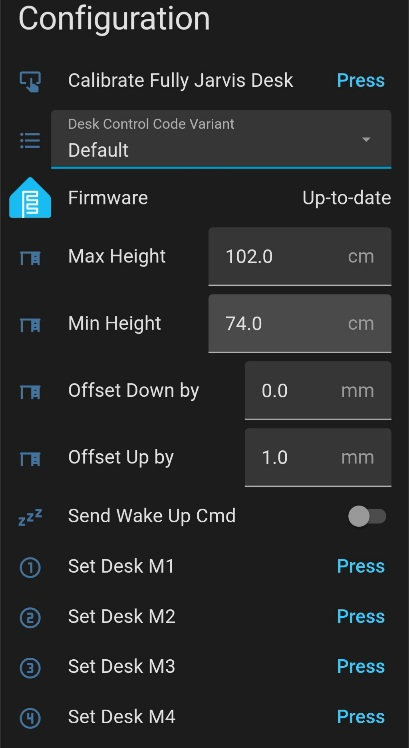

# Home Assistant Screen Layout - What it all does - Configuration 

Before using your DeskUp Pro you need to configure the min & max height values for your desk:

### Calibrate Fully Jarvis Desk Button

Fully Jarvis desks need to use a different calculation for the 4 Preset Memory Sensors (M1, M2, M3, M4) to display the correct cm values.  This button lets you 'calibrate' your desk so it can use that calculation, see [this page for calibration instructions](../setup/troubleshooting/calibrate-fully-jarvis-desk.md).

### Desk Control Code Variant

This dropdown allows different desk control code to be chosen.  This then allows different hex codes to be sent to the standing desk controller.  

- Default - is the original DeskUp Pro code.

- Rocka - Whilst Rocka's Git Repo uses exactly the same hex codes as our default one it had 1 difference with the calculation to set the height on the Height Control. So we have added this as an option in case anyone has issues with the Default.

- Fully Jarvis - Use this option in conjunction with the 'Calibrate Fully Jarvis Desk' button mentioned above so the correct calculation is used for the 4 Preset Memory Sensors (M1, M2, M3, M4).

### Max Height (defaults to cm)

By default we set this to the highest allowed physical height of the Maidesite range of standing desks (126cm).

You should change this to either:
  - Match your desks physical maximum height limit. If you dont know it just raise your desk to its maximum height and use the value from the desk control panel here.
    
  - Or set the desk to be the maximum height you will use on a day to day basis.

    Doing this gives you a better experience when using the cover slider in Home Assistant as this has go up (100%) & go down (0%) buttons.

    _Note: This does not prevent you using memory preset buttons or nudge up/down controls to move the desk outside of this range._

  
### Min Height (defaults to cm)

By default we set this to the lowest allowed physical height of the Maidesite range of standing desks (62cm).

Other than knowing this the instructions are the same as the description above, just for setting the minimum height.

### Offset Down By (defaults to mm)
If you find when lowering the desk it consistently misses the height you wanted when using the "desk height" slider this allows you to fine tune it by x number of mm.

### Offset Up By (defaults to mm)
If you find when raising the desk it consistently misses the height you wanted when using the "desk height" slider this allows you to fine tune it by x number of mm.

### Send Wake Up Cmd
On some desks the desk controller goes to sleep after afew seconds. Enabling this will send a wake up command before sending the desk command. The controller should then respond to the desk command you requested.

### Set Desk M1, M2, M3, M4 buttons
Pressing these will set the current desk's height in to the corresponding memory number preset on the desk's controller.

