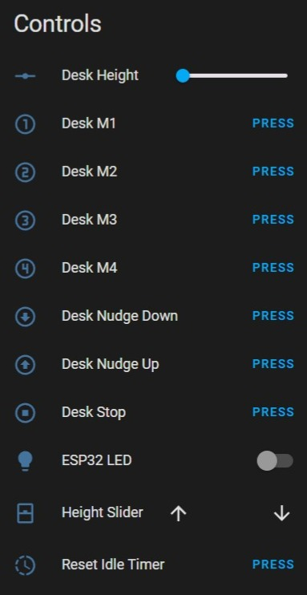

# Home Assistant Screen Layout - What it all does - Controls

All these controls can be pressed in a Home Assistant automation.

### Desk Height (defaults to cm)
Shows the height of the desk that is being returned from the desk's controller. But also let's you set the height of the desk using the slider or from a Home Assistant automation.

### Desk M1, M2, M3, M4 Buttons
When pressed moves the desk to the height set in the memory preset.

### Desk Nudge Down / Up Buttons
When pressed moves the desk up or down by approximately 10mm.

### Desk Stop
When pressed stops a moving desk.

### ESP32 LED (S3 Chips)
Turns on/off the onboard led light. You can also set the color of it.

This is used by the DeskUp Pro firmware only to detect if it is not connected to Wi-Fi, it turns solid red when disconnected and is off when connected. Its exposed to Home Assistant.

### ESP32 LED (C6 Chips)
Is not exposed to Home Assistant as a control because C6 chips only support a single colour. It slowly flashes yellow when disconnected from Wi-Fi or disconnected from Home Assistant.  If everything is connected ok it turns off.

### Height Slider
This is a Home Assistant Cover (currently there is no control in Home Assistant specifically for desks).

It uses the desk height percent sensor to determine its value (0% to 100%).

You can control the desk using the cover slider.

An added benefit of having a Cover entity exposed to Home Assistant is it can also be integrated to Google Home where the desk can be controlled by voice. See the [example automations](home-assistant-automations.md) page for an example of this bring used.

### Reset Idle Time 
When pressed sets the Idle Time sensor back to 0.

See the [example automations](home-assistant-automations.md) page for an example of this bring used.
