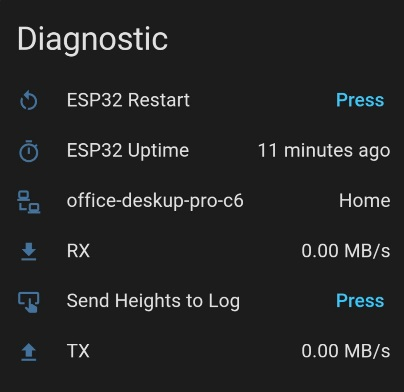

# Home Assistant Screen Layout - What it all does - Diagnostics

### ESP32 Restart
Pressing this will reboot the device.

### ESP32 Uptime
Shows how long the device has been online for.

### Send Heights to Log
This is used to output the min & max physical heights of your desk into the ESPHome Log or the Web UI. You can access the Web UI from a web browser using devicename.local in the browser URL. 

Use this button if you don't know your desks limits when filling in the 2 Min/Max Height text boxes in the configuration section.
