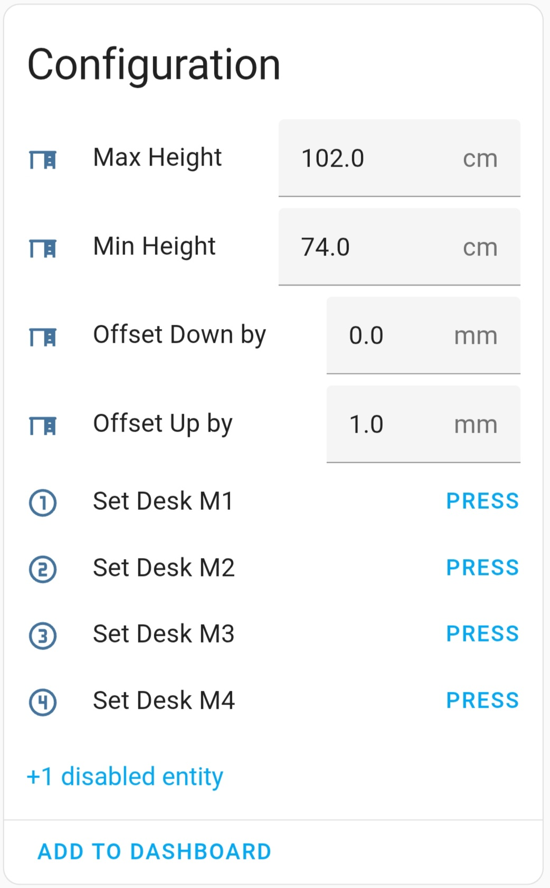

# Home Assistant Screen Layout - What it all does

## Configuration 
Before using your DeskUp Pro you need to configure:
### Height Unit (defaults to cm)

If you use inches toggle this here.

Then restart the DeskUp Pro device for it to take effect. Either press the 'ESP32 Restart' button in Home Assistant or unplug the device and plug it back in.

  
### Max Height (defaults to cm)

By default we set this to the highest allowed physical height of the Maidesite range of standing desks (126cm).

You should change this to either:
  - Match your desks physical maximum height limit. If you dont know it just raise your desk to its maximum height and use the value from the desk control panel here.
    
  - Or set the desk to be the maximum height you will use on a day to day basis.

    Doing this gives you a better experience when using the cover slider in Home Assistant as this has go up (100%) & go down (0%) buttons.

    _Note: This does not prevent you using memory preset buttons or nudge up/down controls to move the desk outside of this range._

If you chose inches for your height unit then you will need to enter inches values into this box.

  
### Min Height (defaults to cm)

By default we set this to the lowest allowed physical height of the Maidesite range of standing desks (62cm).

Other than knowing this the instructions are the same as the description above, just for setting the minimum height.

### Set Desk M1, M2, M3, M4 buttons
Pressing these will set the current desk's height in to the corresponding memory number preset on the desk's controller.

## Sensors

## Controls

## Diagnostics

