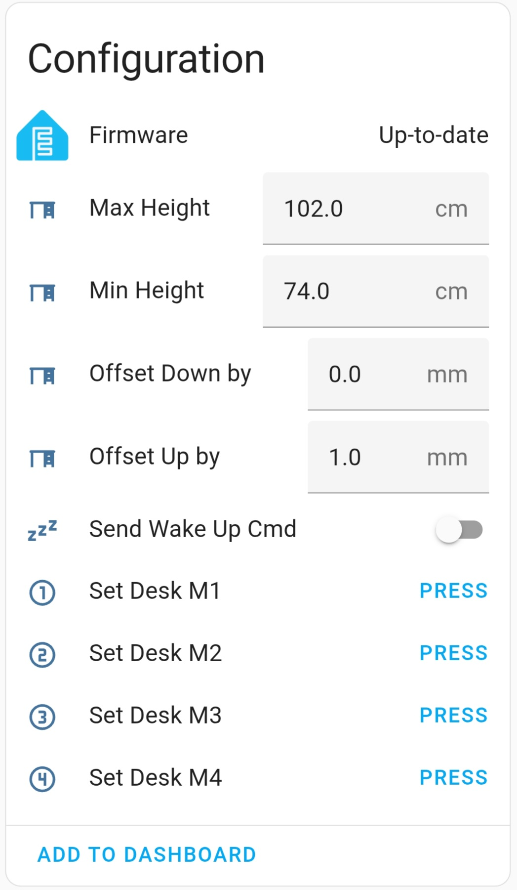
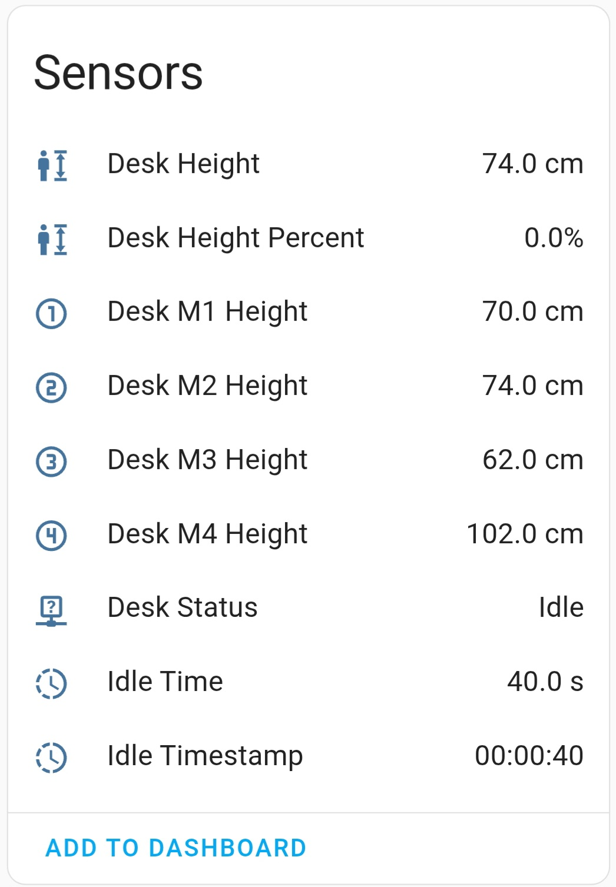
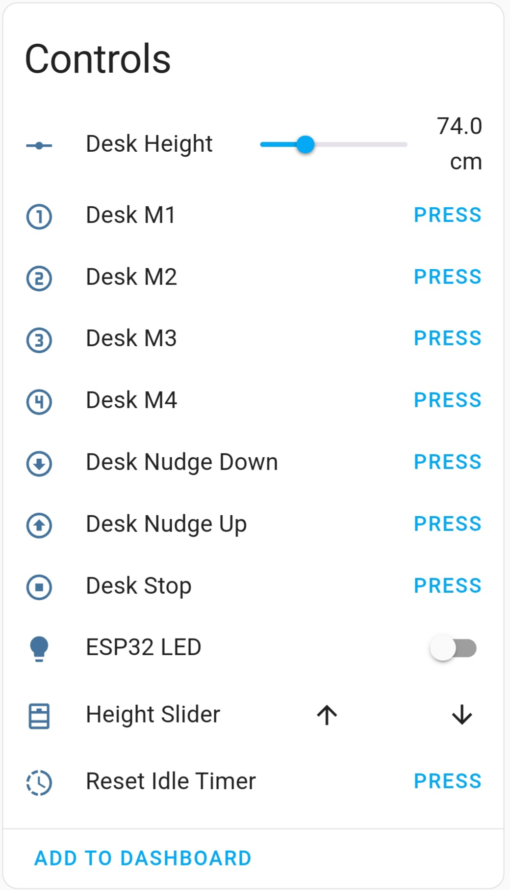
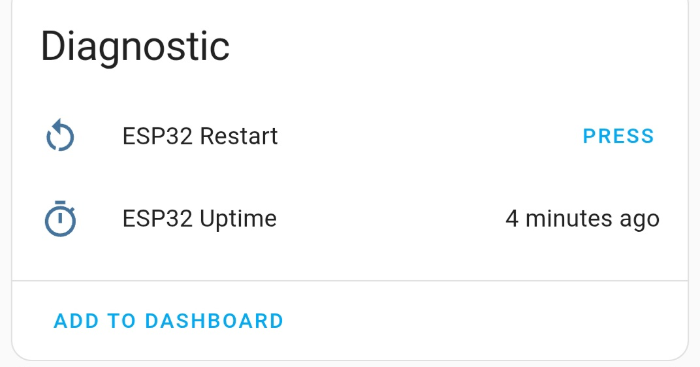

# Home Assistant Screen Layout - What it all does

## Configuration 
Before using your DeskUp Pro you need to configure the min & max height values for your desk:
  
### Max Height (defaults to cm)

By default we set this to the highest allowed physical height of the Maidesite range of standing desks (126cm).

You should change this to either:
  - Match your desks physical maximum height limit. If you dont know it just raise your desk to its maximum height and use the value from the desk control panel here.
    
  - Or set the desk to be the maximum height you will use on a day to day basis.

    Doing this gives you a better experience when using the cover slider in Home Assistant as this has go up (100%) & go down (0%) buttons.

    _Note: This does not prevent you using memory preset buttons or nudge up/down controls to move the desk outside of this range._

  
### Min Height (defaults to cm)

By default we set this to the lowest allowed physical height of the Maidesite range of standing desks (62cm).

Other than knowing this the instructions are the same as the description above, just for setting the minimum height.

### Offset Down By (defaults to mm)
If you find when lowering the desk it consistently misses the height you wanted when using the "desk height" slider this allows you to fine tune it by x number of mm.

### Offset Up By (defaults to mm)
If you find when raising the desk it consistently misses the height you wanted when using the "desk height" slider this allows you to fine tune it by x number of mm.

### Send Wake Up Cmd
On some desks the desk controller goes to sleep after afew seconds. Enabling this will send a wake up command before sending the desk command. The controller should then respond to the desk command you requested.

### Set Desk M1, M2, M3, M4 buttons
Pressing these will set the current desk's height in to the corresponding memory number preset on the desk's controller.

## Sensors

### Desk Height (defaults to cm)
Shows the height of the desk that is being returned from the desk's controller.

### Desk Height Percent
Shows the height of the desk as a percentage value. This is used by the Cover control which can go from 0% to 100%.

### Desk M1, M2, M3, M4 Height (defaults to cm)
Shows the height of the memory preset button that is being returned from the desk's controller.

### Desk Status
Shows if the desk is currently Idle, Raising, or Lowering.

### Idle Time (seconds)
Timer on the DeskUp Pro device that counts the number of seconds the desk has been idle/not moved for.

Use this sensor in Home Assistant automations when you want to trigger an automation to start after the desk has been idle for X number of seconds.

### Idle Timestamp (days, hh:mm:ss)
Converts the idle seconds into a timestamp value that can be displayed on a Home Assistant dashboard.

Days will only be shown if the desk is idle for 1 day.

e.g. 2 days, 04:45:02 

or just 04:45:02 (if days is 0)

## Controls
All these controls can be pressed in a Home Assistant automation.

### Desk Height (defaults to cm)
Shows the height of the desk that is being returned from the desk's controller. But also let's you set the height of the desk using the slider or from a Home Assistant automation.

### Desk M1, M2, M3, M4 Buttons
When pressed moves the desk to the height set in the memory preset.

### Desk Nudge Down / Up Buttons
When pressed moves the desk up or down by approximately 10mm.

### Desk Stop
When pressed stops a moving desk.

### ESP32 LED
Turns on/off the onboard led light. You can also set the color of it.

This is used by the DeskUp Pro firmware only to detect if it is not connected to Wi-Fi, it turns solid red when disconnected and is off when connected. Its exposed to Home Assistant, in case you can think of any other use cases.

### Height Slider
This is a Home Assistant Cover (currently there is no control in Home Assistant specifically for desks).

It uses the desk height percent sensor to determine its value (0% to 100%).

You can control the desk using the cover slider.

An added benefit of having a Cover entity exposed to Home Assistant is it can also be integrated to Google Home where the desk can be controlled by voice. See the [example automations](home-assistant-automations.md) page for an example of this bring used.

### Reset Idle Time 
When pressed sets the Idle Time sensor back to 0.

See the [example automations](home-assistant-automations.md) page for an example of this bring used.

## Diagnostics

### ESP32 Restart
Pressing this will reboot the device.

### ESP32 Uptime
Shows how long the device has been online for.

