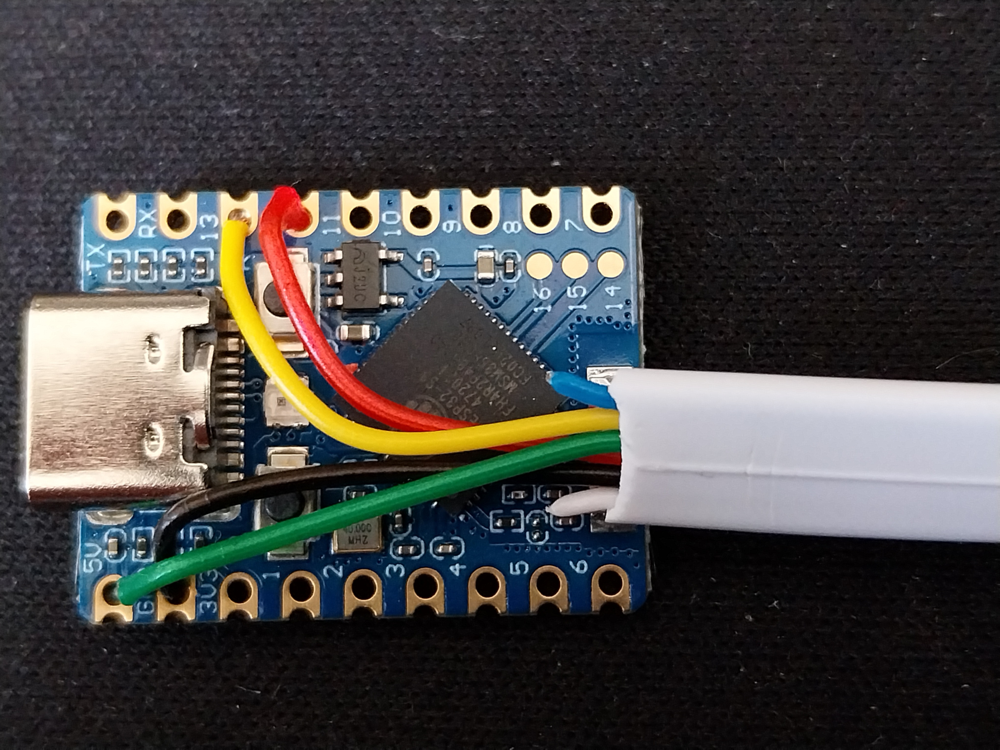

# Everything you need to know to build a DeskUp Pro device yourself

To automate your desk, what we are going to make is the cable below with an RJ12 port at one end and wire it up to an ESP32 at the other.  But before you buy anything check the likely compatibility of your [desk here](../compatibility.md).


## Materials needed
- An ESP32, we used an ESP32-S3 Zero/Mini:

- An RJ12 to RJ12 Cable (6P6C)

- Wire Stripper, Preciva Automatic Cable Stripper and Cutter Tool is pretty good [Amazon.co.uk](https://amzn.to/3FbW10A) or [Amazon.com](https://amzn.to/4iwLz20)

- Soildering Iron


Cut the RJ12 cable to the desired length to fit under your standing desk (we use 9cm).

Then use the wire stripper tool to strip the cable back 2.5cm. 

Then strip off a small amount (lowest setting on the wire stripper) for the following wires, the 2 unused wires can just be cut off.


## RJ12 to ESP32-S3-Zero Pin Mapping

| RJ12 Cable | Cable Colour | ESP32 Pin Used |
| ---------- | ------------ | -------------- |
| PIN 1 | White | Unused |
| PIN 2 | Brown | GND (labelled GND in image) |
| PIN 3 | Red   | GPI12 (labelled 12 in image) |
| PIN 4 | Green | 5V (labelled 5V in image) |
| PIN 5 | Yellow| GPIO13 (labelled 13 in image) |
| PIN 6 | Blue  | Unused |

_Note: I chose GPIO12 & GPIO13 purley for their location on the board to help with routing the cable out the back, but most other pins would be suitable. You can override the pins to be yours in the yaml by adding substitutions to the device in ESPHome builder (see "Let’s set up the ESP32 with the desk controller software" section below):_


Push each wire through the correct pin hole so it comes out the bottom and solder it on the back of the board.



Thats the board and cable all done.  If anything doesn't work later in Home Assistant it's more than likely to do with the soldering!


## 3D Print a Box
### TODO ADD LINK


## Home Assistant Configuration
You first need to setup the ESP32 in Home Assistant which can be done within Home Assistant using ESPHome Builder.

You will need to do this from a laptop/PC. Attach the ESP32 via a USB-C cable to a USB-A or C port on your laptop and then click add a ‘New Device’ and follow the prompts, I called mine: “Office DeskUp Pro Controller”

Once you have the ESP32 device connected to your Wi-Fi you won’t need the USB cable once we are finished.

You should now have this showing in ESPHome Builder:


### Let’s set up the ESP32 with the desk controller software.

In Home Assistant and the ESPHome Builder, Edit the ‘Office DeskUp Pro Controller’. 

Replace it’s contents with the following yaml, but note there are 2 values you need to keep from the original and update in it:

- Your Api Encryption Key
- Your OTA Password

```
substitutions:
  name: "office-deskup-pro-controller"
  friendly_name: "Office DeskUp Pro Controller"

packages:
  device_base: !include common/standingdesk/base.yaml

logger:
  level: DEBUG   #VERBOSE

# Enable Home Assistant API
api:
  encryption:
    key: "YOUR ENCRYPTION KEY HERE"

ota:
  - platform: esphome
    password: "YOUR OTA PASSWORD HERE"

wifi:
  ssid: !secret wifi_ssid
  password: !secret wifi_password
```

The above yaml assumes you want to take full control of the yaml and not have us push any updates to you automatically in which case you also need to download the base.yaml from this Git Repository and copy it onto your Home Assistant's drive in folder: 

```
\\homeassistant.local\config\esphome\common\standingdesk"
```

Edit that file and remove or comment out the packages section as you wont need them (we only use this deployment-config.yaml when we flash purchased devices):

```
packages:
  device_base: !include deployment-config.yaml
```

If you used different pins for tx or rx add the substitutions block as follows using your GPIO pin numbers (these are the default values shown below):
```
substitutions:
  tx_pin: "GPIO13"
  rx_pin: "GPIO12"
```

Save, Validate and then click install to flash the code onto the device.

The device should then be detected by Home Assistant and you can follow the [steps here to add it to Home Assistant](../setup/add-to-home-assistant.md).

