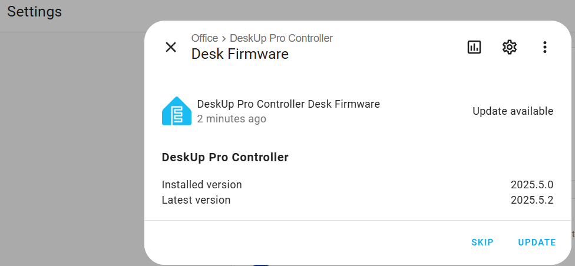

### Notes on how to release a new version

- Make code changes locally (avoiding using Git) on a development version of a DeskUp Pro device.
- No need to worry about version numbers at this point.

- Once development is complete update the base.yaml with a new version number.
- Install again onto the development device and check the new version number is there.
- Copy the changed files from Home Assistant's local folder into the Git folder (locally on a laptop).
- Commit and push to GitHub.

- Copy / Paste the contents of the 'config-to-flash.yaml' over the top of the development DeskUp Pro device in ESPHome.  Keep a copy though as you need to put this back later.

- Run valiate on the development DeskUp Pro device in ESPHome, it should show the new version number as it's pulled from GitHub (after 1 minute).

- Click 'Install' (DO NOT Install onto the device over Wi-Fi) we just need to download the bin files:
  - Install -> Choose manual download (download both options when prompted, Factory Format and OTA Format). You need to click the 'download' button for the 2nd file.

  - Copy both files from 'downloads' into C:\GitHub\smarthomeguys.github.io\DeskUp-Pro-Controller-RJ12\firmware

  - Open Powershell and go to that fireware folder.
  - We need to create an MD5 Hash for the ota file, run this in Powershell:

    (Get-FileHash -Path deskup-pro-controller.ota.bin -Algorithm md5).Hash.ToLower() | Out-File -FilePath firmware.md5 -Encoding ASCII

  - Open VS Code for the Git repo: smarthomeguys.github.io
  - The 2 bin files and a firmware.md5 file should already be listed under commits. 
  - Update version number and the md5 hash (found in firmware.md5 file) in the manifest.json file
  - Check 4 updated files into Git

- Copy the ESPHome contents of the development DeskUp Pro device you saved (somewhere safe) back into ESPHome and save it.

- Users Home Assistant clients should now start saying an updated version is available to install.

  - User who have adopted the device in ESPHome may see this error in the ESPHome Logs.  The device in Home Assistant will appear as unavailabe.
  
WARNING deskup-pro-controller @ 192.168.xx.xx: Connection error occurred: deskup-pro-controller @ 192.168.xx.xx: The device is using plaintext protocol; Try enabling encryption on the device or turning off encryption on the client (ESPHome Logs 2025.4.0)
