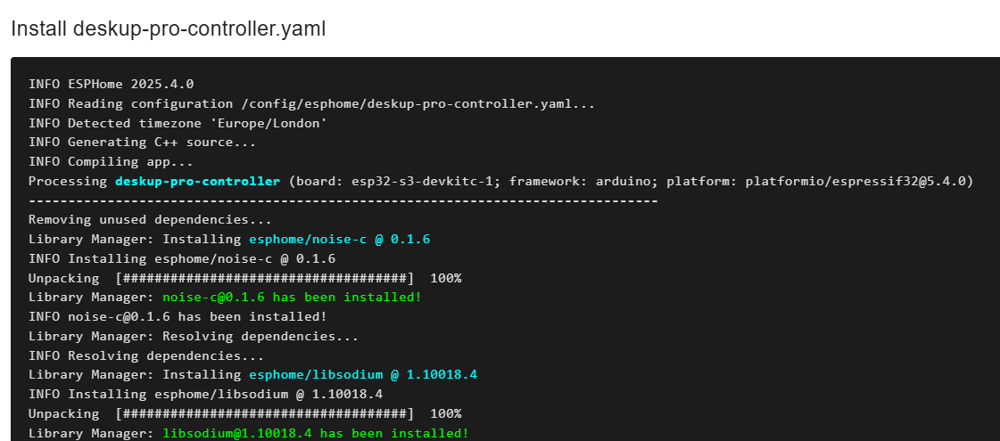

# Adopting the device into ESPHome Builder

After the device is added to Home Assistant you will any updates in Home Assistant as you normally would.

However if you want more control over the device then you can ‘Adopt’ the device into ESPHome Builder.

Go to ESPHome Builder in Home Assistant where it should be saying a device has been discovered.
If it’s not, try restarting the ESP Home Device Builder Addon in Home Assistant.

Click 'Show'.

Click ‘Take Control’ 

You have the opportunity to rename the device, click 'Take Control' when ready.

Click 'Install' to compile the code and install the encryption key.

Note: If the upload fails just click 'Retry'.

Once the upload is completed the ESP32 logs will start streaming, you can just click 'Close'.