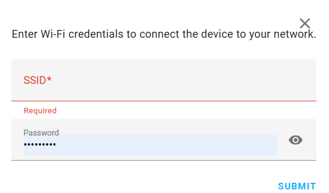

# Setup using Bluetooth 
The device already comes with the firmware flashed, but needs to be connected to Wi-Fi.

If your Home Assistant is already setup to use a Bluetooth Proxy then just attach the DeskUp Pro to your desk’s RJ12 port.  This will provide it power and it will be automatically detected in Home Assistant (usually within 30 seconds).

If it’s not detected, try restarting Home Assistant.

Click ‘Add’

Click 'submit' and enter your Wi-Fi details when asked (this can take 20 seconds).

After entering Wi-Fi details, click 'Submit' and the following box will appear.

You will notice behind the popup a new device was detected.

You can either:
- Close this popup
- Or follow that link which will guide you through adding the device to Home Assistant.

If you click close without following that link you will see a new device is detected and you will need to add it to Home Assistant following [this guide](add-to-home-assistant.md).  

