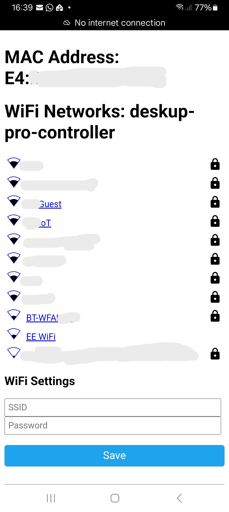
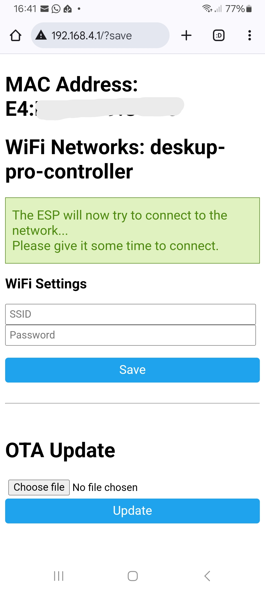

# Setup using Captive Portal (Wi-Fi Hotspot)

The device already comes with the firmware flashed, but needs to be connected to Wi-Fi.
If you can't use Bluetooth or the USB cable options to connect it then after you plug the device in and it's powered for 1 minute it will start broadcasting a Wi-Fi SSID of "DeskUp-Pro".

Connect to it with your phone or laptop (the password is 12345678); 

Open a browser and go to http://192.168.4.1

You should see a page with all the Wi-Fi networks to choose from.  Select the one you want and enter it's password and press save.

You will see the page below saying it will try to connect to the network.  But you don't need to wait, the device should now be showing as a discovered device in Home Assistant.

You can now follow [this guide to add the device to Home Assistant](add-to-home-assistant.md).

