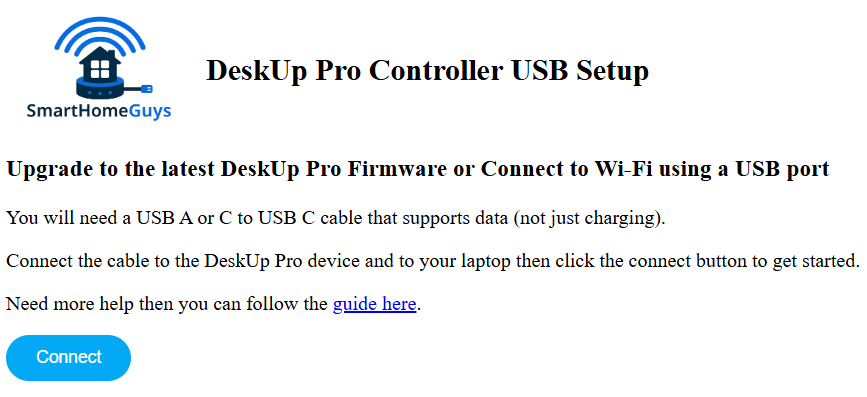
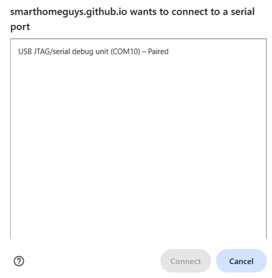
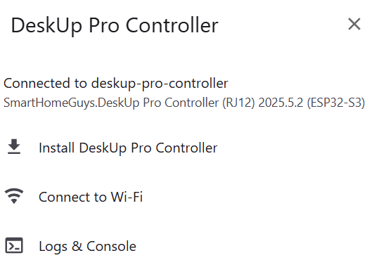
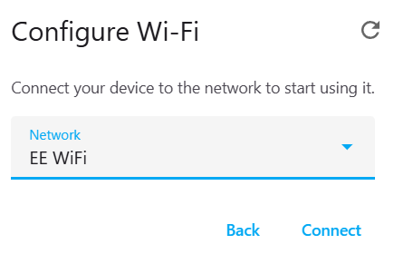
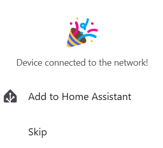
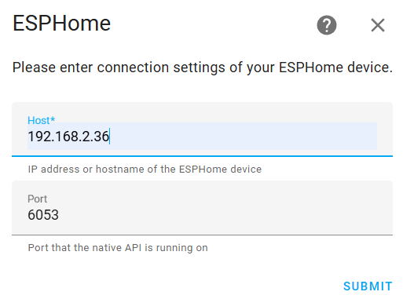
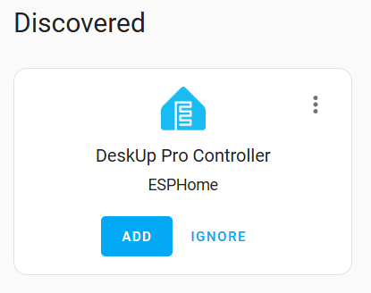

# Setup using USB
The device already comes with the firmware flashed, but needs to be connected to Wi-Fi.

_Note: When you first power on the DeskUp Pro it's Led will be solid Red, this just means it is not connected to your Wi-Fi, once it is the Led will be off._

To setup via USB, Open a Chrome browser to this page:

<a href="https://smarthomeguys.github.io/DeskUp-Pro-Controller-RJ12/Setup.html">https://smarthomeguys.github.io/DeskUp-Pro-Controller-RJ12/Setup.html</a>

Connect the device to a USB C cable and a USB A or C port on your laptop (the cable must support data not just be one for charging).

Click the 'Connect' button, you should see a popup asking you to choose the device on the USB port you plugged it into.

Select it and click 'Connect', you should now see these options:

_Note: You only need to choose the 'Install' option if you wanted to reset the devices firmware (which would be to the latest version)._

What you need to do now is just connect it to Wi-Fi since the device has the firmware installed already.  Choose 'Connect to Wi-Fi'.

Select your Wi-Fi SSID and enter the password

Once connected to Wi-Fi the Red Led will turn off and you should be asked to Add the device to Home Assistant.

If you use Home Assistant follow the rest of this article to integrate it. Otherwise you will need to control the desk using the Api with your Smart Home system, see [this page to get started](/docs/configuration/README.md#configure-and-use-the-deskup-pro-with-another-smart-home-hub).

You can click that button and follow the wizard to add the device to Home Assistant.  

If the device isn't detected by Home Assistant it will ask you for the 'Host', just add the IP number of the DeskUp Pro device here, which you will find by looking on your router.

 Or if you chose to click 'skip' on the previous screen then usually Home Assistant will already have detected the device and will be asking you to add the device to Home Assistant.

You can follow [this guide to add the device to Home Assistant](add-to-home-assistant.md).

## You shouldn't need to, but you can also manually Flash the latest firmware
If you ever need to reset the device's firmware and connect it back to Wi-Fi again just follow the instructions above but choose the 'Install DeskUp Pro Controller' option instead.

This will flash the latest firmware and then prompt to connect it to Wi-Fi.

