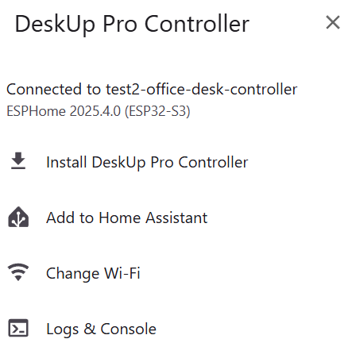
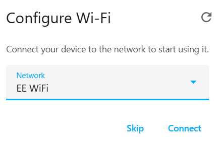
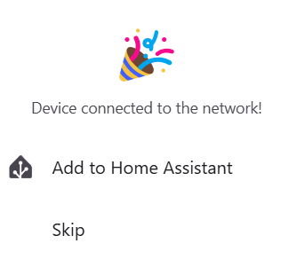

# Setup using USB

TODO

## If all else fails Flash the latest firmware
## TODO: NEED TO TEST THIS!
Open Chrome to this page:

https://smarthomeguys.github.io/DeskUp-Pro-Controller-RJ12/Setup.html

Connect the device to your USB port on your laptop.

Click the 'Connect' button, you should see a popup asking you to choose the device on the USB port you plugged it into.

Select it and click 'Connect', you should now see these options:

Click the 'Install DeskUp Pro Controller' option.

Click 'Confirm' when it asks if you want to overwrite everything on the device.

You will then be asked to connect the device to your Wi-Fi.

Choose yours and click 'Connect'.

You will then be asked to add the device to Home Assistant

