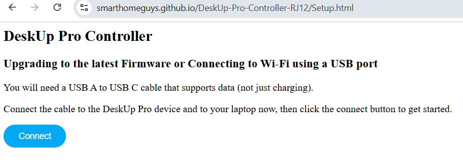

# Setup using USB
The device already comes with the firmware flashed, but needs to be connected to Wi-Fi.

To do this via USB, Open a Chrome browser to this page:

https://smarthomeguys.github.io/DeskUp-Pro-Controller-RJ12/Setup.html

Connect the device to a USB C cable and a USB A port on your laptop (the cable must support data not just be one for charging).

Click the 'Connect' button, you should see a popup asking you to choose the device on the USB port you plugged it into.

Select it and click 'Connect', you should now see these options:

_Note: You only need to choose the 'Install' option if you wanted to reset the devices firmware (which would be to the latest version)._

What you need to do now is just connect it to Wi-Fi since the device has the firmware installed already.  Choose 'Connect to Wi-Fi'.

Select your Wi-Fi SSID and enter the password

Once connected to Wi-Fi you should be asked to Add the device to Home Assistant.

You can click that button and follow the wizard to add the device to Home Assistant.  Or If you look in Home Assistant it will already have detected the device and you can click 'Skip' here and go and add the device from within Home Assistant.

You can follow [this guide to add the device to Home Assistant](add-to-home-assistant.md).

## If all else fails Flash the latest firmware
If you ever need to reset the device's firmware and connect it back to Wi-Fi again just follow the instructions above but choose the 'Install DeskUp Pro Controller' option instead.

